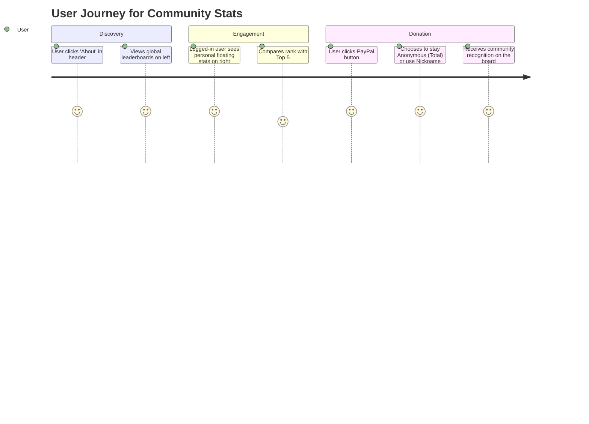
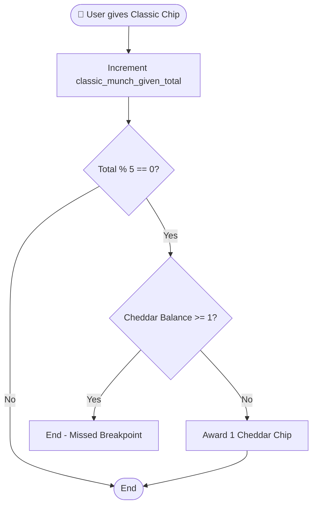

# Community Stats Board & User Panel - Feature Design Document

**Author:** Gemini CLI
**Date:** 2026-05-18
**Status:** Draft
**Version:** 1.1

---

## 1. Feature Overview

### 1.1 Executive Summary

**What:** A new "About" page implementation featuring a Community Stats Board (global leaderboards and totals) and a personalized Login User Stats Panel.

**Why:** To drive user engagement by gamifying the "Chip Cheddar" economy and providing transparency into community contributions, individual impact, and donation support.

**Who:** All Photorium users (visitors see global stats, logged-in users see their personal panel).

---

## 2. Background & Context

### 2.1 Problem Statement

The current "About" page contains static content modules that do not serve the dynamic nature of the Photorium community.

**Current State:**
- "About" page is a placeholder.
- No central place to view total contributions or top contributors.
- No mechanism to track and display community donations.

**Desired State:**
- A high-impact dashboard showing top contributors and community totals.
- A floating **User Stats Panel** on the right side for personalized data.
- Integration with PayPal for donations, tracking both Anonymous totals and Nickname-based leaderboards.

---

## 3. User Experience

### 3.1 User Journey

### 3.2 UI Layout (Two-Column)

- **Left Column (70%):** Community Most Stats & Totals (Weekly Munchers, Monthly Chips, Yearly Y/Y, Top Photos, etc.)
- **Right Column (30%):** Floating **User Stats Panel** for logged-in users. Includes "Total Chips Given," "Cheddar Received," and "Total Photos Fried."

---

## 4. Technical Design

### 4.1 System Architecture

See `docs/stats_board_flow.mmd` for the complete diagram.

### 4.2 Donation Logic

- **Anonymous Donations:** All donations marked "Anonymous" are aggregated into a single `monthly_anonymous_total` field.
- **Identified Donations:** Donations linked to a `nickname` (or logged-in user) are ranked to display the **Top 5 Donors** of the month.
- **Integration:** PayPal button in the dashboard/about page.

### 4.3 "5 Chips = 1 Cheddar" Logic (Activity Diagram)

---

## 5. Data Model (Schema Updates)

### 5.1 New Collection: `donation`
- `amount`: Decimal/Float (Required)
- `isAnonymous`: Boolean (Default: false)
- `user`: Relation (many-to-one to users-permissions.user, optional)
- `nickname`: String (Fallback for non-registered donors)
- `month`: String (e.g., "2026-05" for easy aggregation)

---

## 6. Implementation Plan (Phase 2 - Starting Tomorrow)

1.  **Schema Update**: Create the `donation` collection in Strapi.
2.  **API Build**: Implement the custom `community-stats` aggregation logic (SQLite queries).
3.  **Frontend Layout**: Replace `About.astro` modules with the new grid layout.
4.  **Component Crafting**: Build the floating `UserStatsPanel.tsx` and the `LeaderboardRow.tsx` components.
5.  **Analytics**: Implement the image detail "Click" tracking logic.
